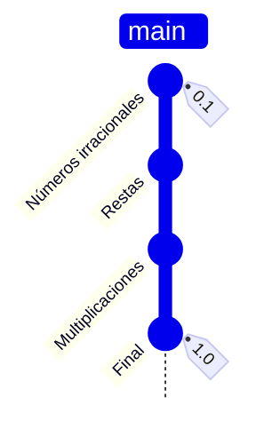
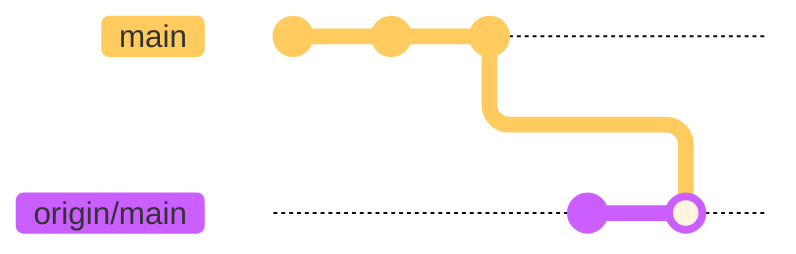
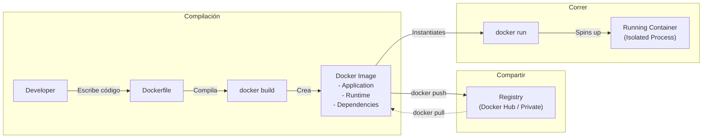

# El arte de la invocación del software:
## Git, Infraestructura, Automatización y Despliegue


<!-- > Teo González Calzada -->

---
layout: default
title: ¿Quién Soy?
docNumber: FM 42-00
---

<script setup>
const tech = [
  'Git', 'Linux', 'Bash', 'Python', 'Docker',
  'GitlabCI', 'Github Actions', 'Jenkins',
  'Vue.js', 'NodeJS', 'TypeScript',  'PHP', 'Laravel',
  'TailwindCSS', 'GraphQL', 'PostgreSQL', 'MariaDB', 'MySQL',
  'Netlify', 'AWS', 'GCP', 'Oracle Cloud'
]
// Randomizes the tech stack to make it look cooler
const techStack = [...tech].sort(() => Math.random() - 0.5);
</script>

<!-- Slide container wrapper (or relative block) -->
<div class="relative w-full h-full">

  <!-- Title starting perfectly centered using CSS transforms -->
  <div
    v-motion
    :initial="{ x: '-50%', y: '-50%', top: '50%', left: '50%', scale: 1.25 }"
    :click-1="{ x: '0%', y: '0%', top: '0%', left: '0%', scale: 0.65 }"
    :transition="{ duration: 600, easing: 'easeInOut' }"
    class="absolute origin-top-left text-4xl default"
  >
    <h1>¿Quién soy?
      <p class="text-base text-gray-400">Ad-hominem</p>
    </h1>
  </div>

  <br />

  <!-- Content appears on click 1 when the title moves -->
  <div v-click class="mt-8">
    Programador
    <ul v-click=2>
      <li>Desarrollador Web y de aplicaciones móviles</li>
      <!-- TODO: Is this point ok? -->
      <li>Desarrollador de automatizaciones y procesamiento de datos</li>
      <li>Ing. en DevOps</li>
      <li>Ing. en Releases para una distribución de Linux</li>
    </ul>
  </div>

  <div v-click class="mt-4">
    <p v-click>Herramientas</p>
    <InfiniteTicker :items="techStack" :duration="15" />
  </div>
</div>

<!-- Es necesario apelar a la autoridad, para evitar falacias ad-hominem en las cabezas de los oyentes. -->


---
layout: section
docNumber: FM 42-00
---

## Introducción


<!--
  Esta será una plática técnica más que teórica, con el objetivo de que recuerden vagamente los conceptos para cuando estén haciendo cualquier cosa relacionada.

  Este será un viaje de descubrimiento en el que estaremos viendo, de principio a fin, la mayoría (o todas) las herramientas que se usan para asegurar un flujo contínuo de vida de tus aplicaciones, desde el código hasta la distribución.
-->

---
layout: default
docNumber: FM 42-00
---

<!-- Title starting perfectly centered using CSS transforms -->
<div
  v-motion
  :initial="{ x: '-50%', y: '-50%', top: '50%', left: '50%', scale: 1.25 }"
  :click-1="{ x: '0%', y: '0%', top: '8%', left: '5%', scale: 0.65 }"
  :transition="{ duration: 600, easing: 'easeInOut' }"
  class="absolute origin-top-left text-4xl default"
>

# ¿Qué veremos? 

</div>

<ul class="pt-12">
  <!-- <span > -->
    <li v-click>Preparación del código</li>
    <ul v-click>
      <li>Linux</li>
      <li>Bash & Scripting</li>
      <li>Git</li>
    </ul>
  <!-- </span> -->
  <span v-click>
    <li>Compilación</li>
    <ul>
      <li>Precompilaciones, compilaciones y tests</li>
      <li>Docker</li>
    </ul>
  </span>
  <span v-click>
    <li>Distribución</li>
    <ul>
      <li>Integración Contínua</li>
    </ul>
  </span>
</ul>

<!-- Herramientas como bloques fundamentales de construcción, se requiere el anterior para entender el siguiente -->

---
sectionNumber: '1'
docNumber: FM 42-00
---

# Addendum: Estándares

> No hay tal cosa como un estándar para nada de esto.


---
layout: section
sectionNumber: '1'
docNumber: FM 42-01
---

# Capítulo 1
## Preparando el código

<template v-slot:descriptor>
Linux, Git y otras herramientas
</template>


---
layout: default
---

# Linux

Es un núcleo para un sistema operativo que tiene muchas cualidades, entre ellas:

- Está altamente documentado
- Es modificable
- Es gratis
- Es ligero
- Todo es un archivo
- BASH

<!--
Podría, y he dado clases completas hablando exclusivamente de linux, como núcleo y como "sistema operativo".

Lo importante aquí es los básicos.

Todo es un archivo: No hay editor de registros, todos los archivos de configuración suelen ser archivos de texto sencillos, puedes partes enormes del sistema cambando un solo archivo.

-->

---
layout: default
---

### ¿Y qué es BASH?

Es un acceso a la terminal (shell), y un lenguaje de programación para Linux.

<div class="code-dark">
<CodeBlock lang="bash" title="Ejemplo básico de BASH">

````md magic-move
```bash
# Lista los archivos
ls

# Crea un folder/directorio
mkdir folder

# Mueve un archivo al directorio
mv arhivo destino

# Comprime un directorio
tar argumentos folder
```
```bash
# Lista las fotos en el folder actual
ls -al | grep *.jpg

# Crea un nuevo folder
mkdir photos

# Mueve todas las fotos al nuevo folder
mv *.jpg photos/

# Comprime las fotos
tar czf photos.tar.gz photos/
``` 
````

</CodeBlock>
</div>

---
layout: two-column
title: GIT
---

::left::

Esta es la forma *normal* en la que se ve un proyecto/tarea.


::right::

# GIT

¿Y si pudiera verse mejor?


---

### Instalación de git

- Windows:
  - `winget install --id Git.Git -e` ó
  - *bajar el .exe de gitforwindows.com* ó
  - Instalar WSL, instalar algún contenedor de linux y después instalar Git.

- Mac:
  - `git --version` en la terminal ó
  - `brew install git` en la terminal.

- Linux:
  - `sudo dnf install git-all` ó
  - `sudo pacman -S git`

Más información en: [https://github.com/git-guides/install-git](https://github.com/git-guides/install-git)

<!-- git --version en mac debería auto-instalar x-code tools  -->

---

### Configuración de Git

<div class="code-dark">
<CodeBlock lang="bash" title="Ejemplo básico de BASH">

````md magic-move
```sh
# También tienes que poner tu nombre y correo, para "firmar" los commits
git config --global user.name "Satoru Gojou"
git config --global user.email "satoru.gojou@tpjhs.edu"
```

```sh
# También tienes que poner tu nombre y correo, para "firmar" los commits
git config --global user.name "Satoru Gojou"
git config --global user.email "satoru.gojou@tpjhs.edu"

# Además deberías firmar tus commits
gpg --full-generate-key
gpg --list-secret-keys --keyid-format=long
gpg --armor --export 53CUR3K3Y142912T

git config --global user.signingkey 53CUR3K3Y142912T
```
````

</CodeBlock>
</div>


---
layout: default
title: GIT - Sanctissima Trinitas
---


<span class="mb-2">
  Estos son los únicos tres comandos que necesitas en Git
</span>


<div class="code-dark mb-2">
<CodeBlock lang="bash" title="GIT- Sanctissima Trinitas">


````md magic-move
```sh {1-2|4-5|7-8|all}
# Inicializamos el repositorio
git init

# Agregamos archivos y creamos un commit
git add * && git commit -m "Mensaje de commit"

# Mandamos el commit al servidor
git push remote/branch
```

```sh
# ¿Y si copiamos el repositorio desde otro lugar?
git clone https://github.com/ytnrvdf/wha-spell-simulator.git

# Agregamos archivos de C y creamos un commit
git add *.cpp && git commit -m "Se agregó un punto y coma"

# Mandamos el commit al servidor
git push origin/main
```
````

</CodeBlock>
</div>

Para generar un historial



<!-- Esto es todo lo que necesitas para usar git en tus proyectos! En esta época no debe ser una excusa perder tus proyectos. -->

---
layout: default
title: Pero ¿Dónde está la magia en eso?
---

<div class="code-dark">
<CodeBlock lang="bash" title="Ejemplo básico de BASH">


````md magic-move

```sh {1-2|4-5|7-8|10-13|15-16|all}
# ¿Y si empezamos a trabajar en otras cosas?
git switch -c branch

# ¿Y si queremos mezclar la rama secundaria con la principal?
git rebase origin/main

# ¿Y si quieres modificar los últimos 3 commits?
git rebase -i HEAD~3

# ¿Y si necesitamos reescribir commits?
# Manteniendo tus cambios actuales
git log --oneline # copias el hash
git revert HASH

# Eliminando tus cambios actuales
git reset --hard HEAD@{10.minutes.ago}
```

```sh
# ¿Y si empezamos a trabajar en otras cosas? (Crear una linea de tiempo diferente)
git switch -c anagrama

# ¿Y si queremos mezclar la linea temporal secundaria con la principal?
git rebase origin/earth-616

# ¿Y si quieres modificar los últimos 3 eventos de tu linea temporal?
git rebase -i HEAD~3

# ¿Y si necesitamos volver en el tiempo y crear una línea temporal diferente?
# Creando un universo alterno (Dragon Ball Z)
git log --oneline # copias el hash
git revert HASH

# Destruyendo el universo local (Volver al futuro)
git reset --hard HEAD@{30.minutes.ago}
```

````


</CodeBlock>
</div>

---
layout: default
title: Git Hooks
---

# Hooks

Permiten establecer reglas, rutinas o scripts que hagan cualquier tipo de proceso en el código, antes de enviarlo al servidor, o incluso, antes de hacer commit.

Ejemplo: Puedes establecer reglas de estilo para el código, estas son verificadas por un *linter*;

<div class="code-dark">
<CodeBlock lang="javsacript" title="Ejemplo de cómo se ve el código antes y después">

````md magic-move
```js
const d20 = Math.floor(Math.random() * 10);;
if(d20==20){ print("Nat 20")}
else if(d20>=10){ print("Hit")}
else{ print("Damaged")
}
```

```js
const d20 = Math.floor(Math.random() * 10);;
if (d20 == 20) {
    print("Nat 20");
} else if (d20 >= 10) {
    print("Hit");
} else {
    print("Damaged")
//                 ^? Falta punto y coma
}
```
````

</CodeBlock>
</div>

> **Recordatorio:** Si bien los hooks funcionan tanto en el servidor y como en el cliente, suelen ser complicados de configurar en el servidor.

<!-- **Recordatorio:** Nunca confíes en tus usuarios, incluso si son programadores. -->

---

## Hosteando el código

Ya que tienes tu código de la forma que necesitas, en un *repositorio* git, es momento de plantear como lo vas a compartir.

Opciones:

<span v-click.hide>

- Un servidor de archivos convencional (SFTP/SMB)
- Por mensajes de whatsapp, en un *.zip*.

</span>

<span v-click>

Un servidor de código:

  - Github
  - Gitlab
  - BitBucket
  - GitTea

</span>

<!--
Si nos tomamos la molestia de hacer un repositorio de git, el crear un sistema de folders en un servidor convencional o de nombres por whatsapp es dar un paso adelante y dos pasos atrás.

GitTea es para aquellos que se atrevan a hacer su propio sistema de hosteo.
-->

---
layout: section
sectionNumber: '2'
docNumber: FM 42-02
---

# Capítulo 2
## Compilando el código

<template v-slot:descriptor>
Compilaciones reproducibles
</template>

---

### Tengo el código, ¿Y ahora?

Lo compilas, y verificas que las pruebas pasen y los linters no arrojen problemas.

`gcc` para C y C++, `npm build` para proyectos de NodeJS. Incluso en proyectos con PHP o Python que son lenguajes interpretados es necesario este paso.

El objetivo es generar un programa de manera consistente, no sólo una vez si no todas. Resolución de dependencias, estructura de folders, architectura del CPU, todo debe estar documentado y ser reproducible.

---
layout: default
---

## Docker

> En mi máquina si funciona - Todos, alguna vez

Más de una vez he escuchado estas palabras de parte de un programador, incluyéndome.

Son muchas las causas que pueden hacer que un programa no sea *portable*, una forma de resolver este problema es con el uso de contenedores de Docker, Dockers.

<!-- Ya sea una dependencia que se instaló fuera de lugar, un folder que no se creó, un archivo que no se configuró, o la cantidad de pantallas conectadas a una computadora puede hacer que el programa funcione en un dispositivo y otro no. -->

---
layout: default
title: Docker storage.
---




---
layout: default
title: Docker ejemplos
---


### ¿Cómo funciona un dockerfile?

<div class="code-dark">
<CodeBlock lang="bash" title="Ejemplo básico de BASH">

```dockerfile
# FRONTEND BUILD
# Built on the native build platform: the output (/front/dist) is static JS/CSS,
# fully architecture-independent, so there is no need to emulate the target arch.
FROM --platform=$BUILDPLATFORM node:${NODE_VERSION}-alpine${ALPINE_VERSION}@sha256:${NODE_ALPINE_SHA256} AS frontend-build
WORKDIR /front

COPY ./frontend/package*.json ./
RUN npm ci --ignore-scripts --no-audit --no-fund

COPY ./frontend ./
RUN npm run build
```

</CodeBlock>
</div>