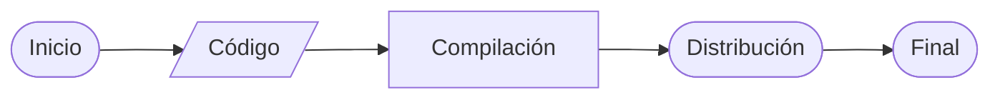
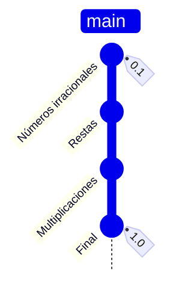
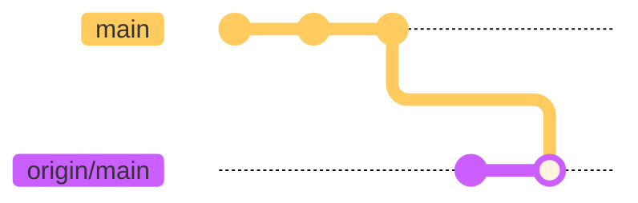

# El arte de la invocación del software:
## Git, Infraestructura, Automatización y Despliegue


<!-- > Teo González Calzada -->

---
layout: default
title: ¿Quién Soy?
docNumber: FM 42-00
---

<script setup>
const tech = [
  'Git', 'Linux', 'Bash', 'Python', 'Docker',
  'GitlabCI', 'Github Actions', 'Jenkins',
  'Vue.js', 'NodeJS', 'TypeScript',  'PHP', 'Laravel',
  'TailwindCSS', 'GraphQL', 'PostgreSQL', 'MariaDB', 'MySQL',
  'Netlify', 'AWS', 'GCP', 'Oracle Cloud'
]
// Randomizes the tech stack to make it look cooler
const techStack = [...tech].sort(() => Math.random() - 0.5);
</script>

<!-- Slide container wrapper (or relative block) -->
<div class="relative w-full h-full">

  <!-- Title starting perfectly centered using CSS transforms -->
  <div
    v-motion
    :initial="{ x: '-50%', y: '-50%', top: '50%', left: '50%', scale: 1.25 }"
    :click-1="{ x: '0%', y: '0%', top: '0%', left: '0%', scale: 0.65 }"
    :transition="{ duration: 600, easing: 'easeInOut' }"
    class="absolute origin-top-left text-4xl default"
  >
    <h1>¿Quién soy?
      <p class="text-base text-gray-400">Ad-hominem</p>
    </h1>
  </div>

  <br />

  <!-- Content appears on click 1 when the title moves -->
  <div v-click class="mt-8">
    Programador
    <ul v-click=2>
      <li>Desarrollador Web y de aplicaciones móviles</li>
      <!-- TODO: Is this point ok? -->
      <li>Desarrollador de automatizaciones y procesamiento de datos</li>
      <li>Ing. en DevOps</li>
      <li>Ing. en Releases para una distribución de Linux</li>
    </ul>
  </div>

  <div v-click class="mt-4">
    <p v-click>Herramientas</p>
    <InfiniteTicker :items="techStack" :duration="15" />
  </div>
</div>

<!-- Es necesario apelar a la autoridad, para evitar falacias ad-hominem en las cabezas de los oyentes. -->


---
layout: section
docNumber: FM 42-00
---

## Introducción



<!--
  Este será un viaje de descubrimiento en el que estaremos viendo, de principio a fin, la mayoría (o todas) las herramientas que se usan para asegurar un flujo contínuo de vida de tus aplicaciones, desde el código hasta la distribución.
-->

---
layout: default
docNumber: FM 42-00
---

<!-- Title starting perfectly centered using CSS transforms -->
<div
  v-motion
  :initial="{ x: '-50%', y: '-50%', top: '50%', left: '50%', scale: 1.25 }"
  :click-1="{ x: '0%', y: '0%', top: '8%', left: '5%', scale: 0.65 }"
  :transition="{ duration: 600, easing: 'easeInOut' }"
  class="absolute origin-top-left text-4xl default"
>

# ¿Qué veremos? 

</div>

<ul class="pt-12">
  <!-- <span > -->
    <li v-click>Preparación del código</li>
    <ul v-click>
      <li>Linux</li>
      <li>Bash & Scripting</li>
      <li>Git</li>
    </ul>
  <!-- </span> -->
  <span v-click>
    <li>Compilación</li>
    <ul>
      <li>Precompilaciones y tests</li>
      <li>Docker</li>
    </ul>
  </span>
  <span v-click>
    <li>Distribución</li>
    <ul>
      <li>CI/CD</li>
    </ul>
  </span>
</ul>

<!-- Herramientas como bloques fundamentales de construcción, se requiere el anterior para entender el siguiente -->

---
sectionNumber: '1'
docNumber: FM 42-00
---

# Addendum: Estándares

> No hay tal cosa como un estándar para nada de esto.


---
layout: section
sectionNumber: '2'
docNumber: FM 42-01
---

# Capítulo 1
## Preparando el código

<template v-slot:descriptor>
Linux, Git y otras herramientas
</template>


---
layout: default
---

# Linux

Es un núcleo para un sistema operativo que tiene muchas cualidades, entre ellas:

- Está altamente documentado
- Es modificable
- Es gratis
- Es ligero
- Todo es un archivo
- BASH

<!--
Podría, y he dado clases completas hablando exclusivamente de linux, como núcleo y como "sistema operativo".

Lo importante aquí es los básicos
-->

---
layout: default
---

### ¿Y qué es BASH?

Es un acceso a la terminal (shell), y un lenguaje de programación para Linux.

<div class="code-dark">
<CodeBlock lang="bash" title="Ejemplo básico de BASH">

````md magic-move
```bash
ls                # Lista los archivos
mkdir folder      # Crea un folder/directorio
mv arhivo destino # Mueve un archivo al directorio
```
```bash
ls -al | grep *.jpg # Lista las fotos en el folder actual
mkdir photos        # Crea un nuevo folder
mv *.jpg photos/    # Mueve todas las fotos al nuevo folder
```
````

</CodeBlock>
</div>

---
layout: two-column
title: GIT
---

::left::

Esta es la forma *normal* en la que se ve un proyecto/tarea.


::right::

# GIT

¿Y si pudiera verse mejor?


---

### Instalación de git

- Windows:
  - `winget install --id Git.Git -e` ó
  - *bajar el .exe de gitforwindows.com* ó
  - Instalar WSL, instalar algún contenedor de linux y después instalar Git.

- Mac:
  - `git --version` en la terminal ó
  - `brew install git` en la terminal.

- Linux:
  - `sudo dnf install git-all` ó
  - `sudo pacman -S git`

Más información en: [https://github.com/git-guides/install-git](https://github.com/git-guides/install-git)

<!-- git --version en mac debería auto-instalar x-code tools  -->

---

### Configuración de Git

<div class="code-dark">
<CodeBlock lang="bash" title="Ejemplo básico de BASH">

````md magic-move
```sh
# También tienes que poner tu nombre y correo, para "firmar" los commits
git config --global user.name "Satoru Gojou"
git config --global user.email "satoru.gojou@tpjhs.edu"
```

```sh
# También tienes que poner tu nombre y correo, para "firmar" los commits
git config --global user.name "Satoru Gojou"
git config --global user.email "satoru.gojou@tpjhs.edu"

# Además deberías firmar tus commits
gpg --full-generate-key
gpg --list-secret-keys --keyid-format=long
gpg --armor --export 53CUR3K3Y142912T

git config --global user.signingkey 53CUR3K3Y142912T
```
````

</CodeBlock>
</div>


---
layout: default
title: GIT - Sanctissima Trinitas
---

Estos son los únicos tres comandos que necesitas para tener un proyecto en Git.


<div class="code-dark">
<CodeBlock lang="bash" title="GIT- Sanctissima Trinitas">


````md magic-move
```sh {1-2|4-5|7-8|all}
# Inicializamos el repositorio
git init

# Agregamos archivos y creamos un commit
git add * && git commit -m "Mensaje de commit"

# Mandamos el commit al servidor
git push remote/branch
```

```sh
# ¿Y si copiamos el repositorio desde otro lugar?
git clone https://github.com/ytnrvdf/wha-spell-simulator.git

# Agregamos archivos de C y creamos un commit
git add *.cpp && git commit -m "Se agregó un punto y coma"

# Mandamos el commit al servidor
git push origin/main
```
````

</CodeBlock>
</div>

Para generar un historial




---
layout: default
title: Sanctissima Trinitas
---

### Git
#### Sanctissima Trinitas


````md magic-move
```sh {1-2|4-5|7-8|all}
# Inicializamos el repositorio
git init

# Agregamos archivos y creamos un commit
git add * && git commit -m "Mensaje de commit"

# Mandamos el commit al servidor
git push remote/branch
```

```sh
# ¿Y si copiamos el repositorio desde otro lugar?
git clone https://github.com/ytnrvdf/wha-spell-simulator.git

# Agregamos archivos de C y creamos un commit
git add *.cpp && git commit -m "Se agregó un punto y coma"

# Mandamos el commit al servidor
git push origin/main
```
````

Estos son los únicos tres comandos que necesitas para tener un proyecto en Git.


<!-- Esto es todo lo que necesitas para usar git en tus proyectos! En esta época no debe ser una excusa perder tus proyectos. -->

---
layout: default
title: Pero ¿Dónde está la magia en eso?
codeTitle: Pero ¿Dónde está la magia en eso?
codeLang: bash
---

<div class="code-dark">
<CodeBlock lang="bash" title="Ejemplo básico de BASH">

````md magic-move
```sh {1-2|4-5|7-8|10-13|15-16|all}
# ¿Y si empezamos a trabajar en otras cosas?
git switch -c branch

# ¿Y si queremos mezclar la rama secundaria con la principal?
git rebase origin/main

# ¿Y si quieres modificar los últimos 3 commits?
git rebase -i HEAD~3

# ¿Y si necesitamos reescribir commits?
# Manteniendo tus cambios actuales
git log --oneline # copias el hash
git revert HASH

# Eliminando tus cambios actuales
git reset --hard HEAD@{10.minutes.ago}
```

```sh
# ¿Y si empezamos a trabajar en otras cosas? (Crear una linea de tiempo diferente)
git switch -c anagrama

# ¿Y si queremos mezclar la linea temporal secundaria con la principal?
git rebase origin/earth-616

# ¿Y si quieres modificar los últimos 3 eventos de tu linea temporal?
git rebase -i HEAD~3

# ¿Y si necesitamos volver en el tiempo y crear una línea temporal diferente?
# Creando un universo alterno (Dragon Ball Z)
git log --oneline # copias el hash
git revert HASH

# Destruyendo el universo local (Volver al futuro)
git reset --hard HEAD@{30.minutes.ago}
```
````

</CodeBlock>
</div>

---
layout: default
title: Git Hooks
---

### Hooks

Útiles 


---
layout: chart-full
figNumber: 3-1
figLabel: BRIEFING WORKFLOW
---

### Linux


